# Frontend Mentor - Mood tracking app solution

This is a solution to the [Mood tracking app challenge on Frontend Mentor](https://www.frontendmentor.io/challenges/mood-tracking-app-E2XeKhDF0B). Frontend Mentor challenges help you improve your coding skills by building realistic projects.

## Table of contents

- [Overview](#overview)
  - [The challenge](#the-challenge)
  - [Screenshot](#screenshots)
  - [Links](#links)
- [My process](#my-process)
  - [Built with](#built-with)
  - [What I learned](#what-i-learned)
  - [Continued development](#continued-development)
- [Author](#author)

## Overview

### The challenge

Users should be able to:

- Log their mood, feelings, reflections, and sleep each day
- See today's mood, feelings, reflection, and sleep, once logged
- See a relevant mood quote based on today's mood
- See a graph showing the most recent eleven records to identify mood and sleep trends
- Interact with each bar on the mood and sleep trends chart to see all information about that day
- See their average mood and sleep from the past five check-ins and see how they compare with the previous five
- Update their name or avatar through settings
- View the optimal layout for the interface depending on their device's screen size
- See hover and focus states for all interactive elements on the page
- **Bonus**: Save details to a database (build the project as a full-stack app)
- **Bonus**: Create an account and log in (add user authentication to the full-stack app)
- **Bonus**: Integrate with a third-party image-hosting service for the avatar upload

### Screenshots

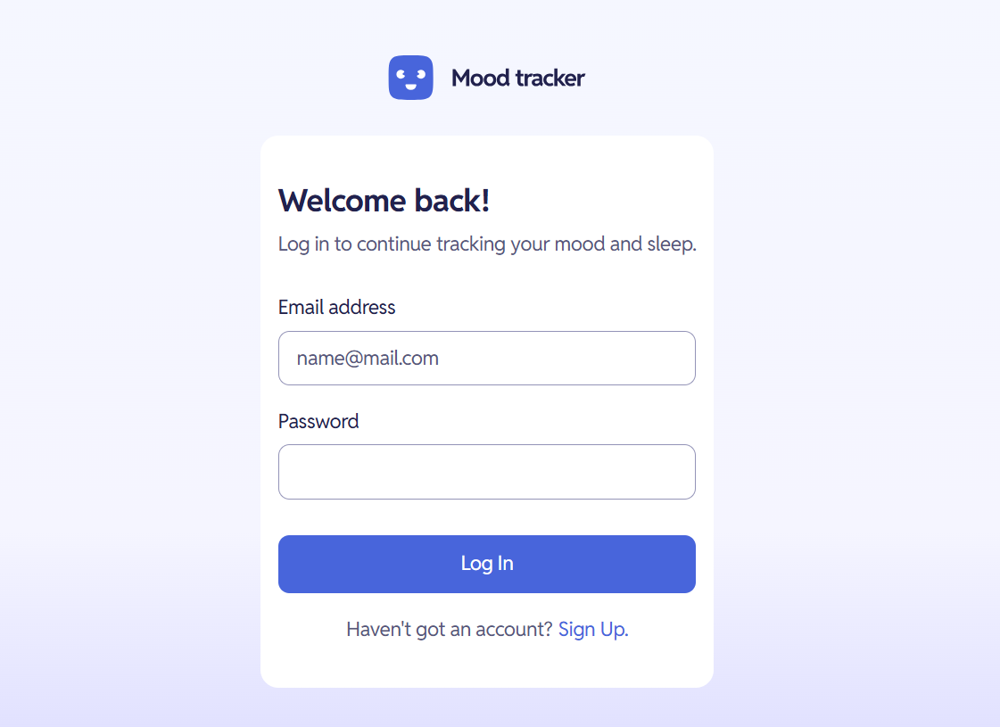
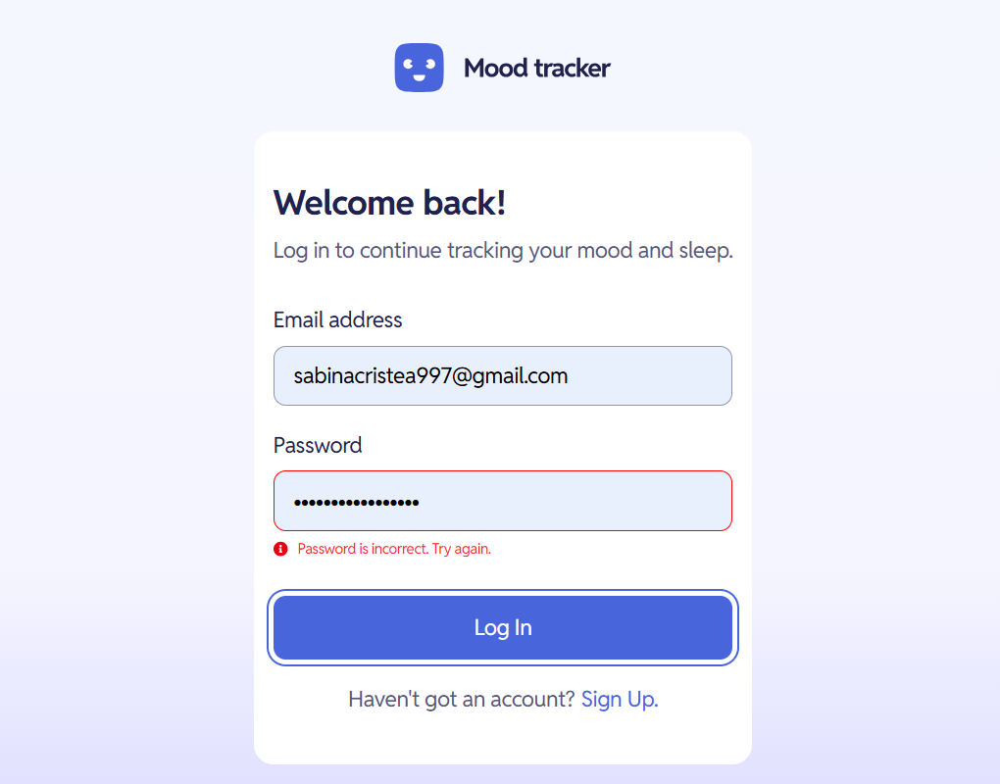
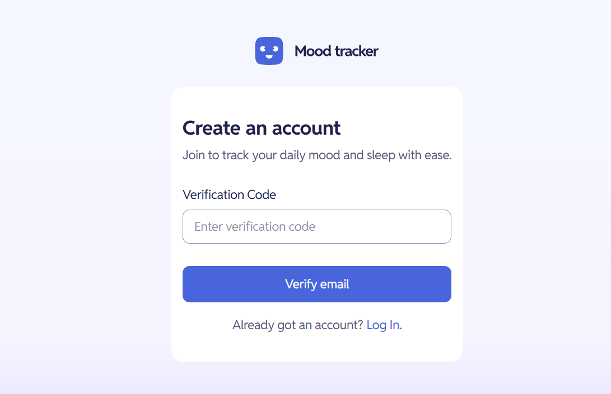
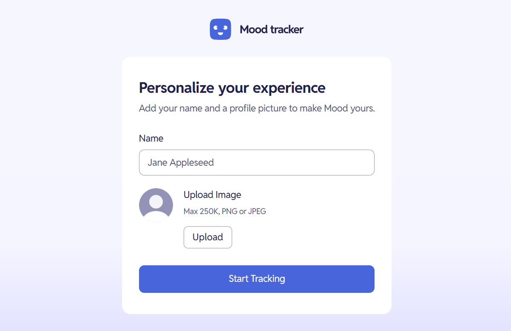
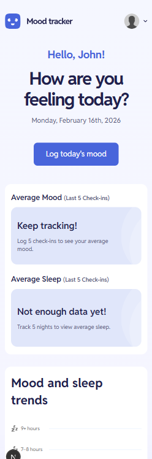
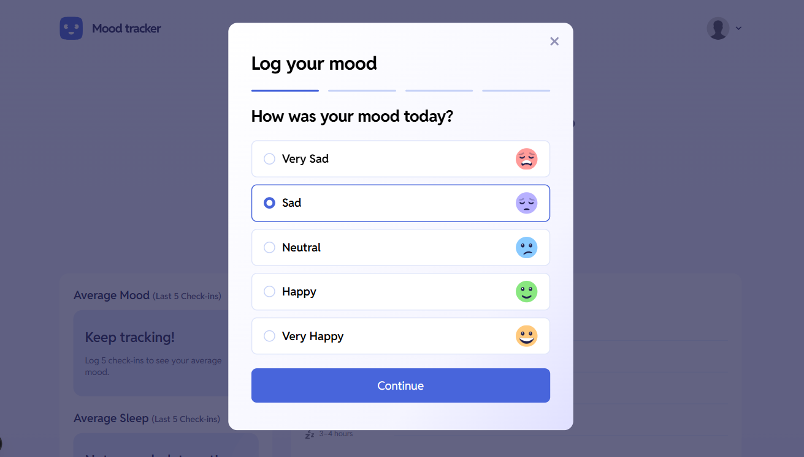
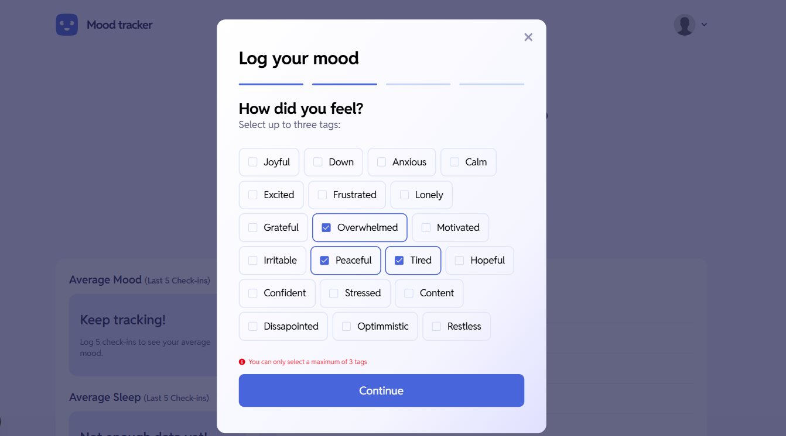
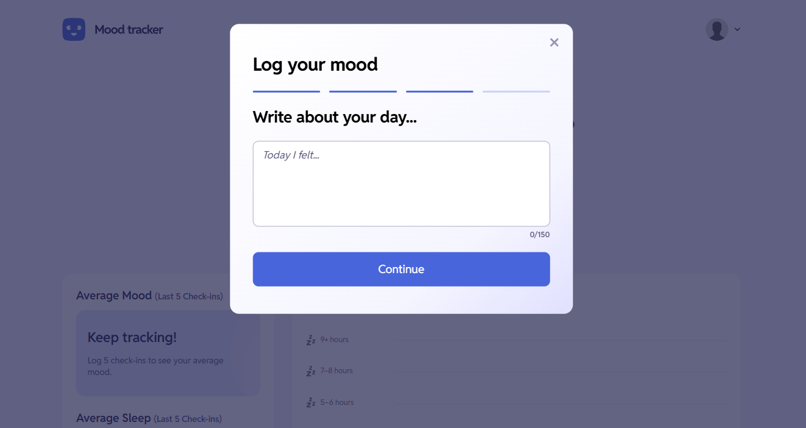
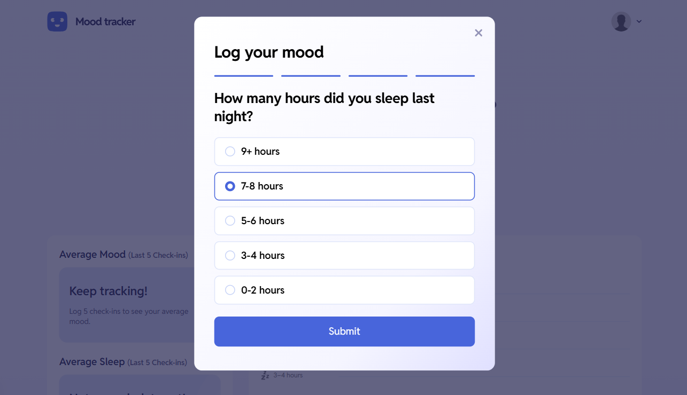
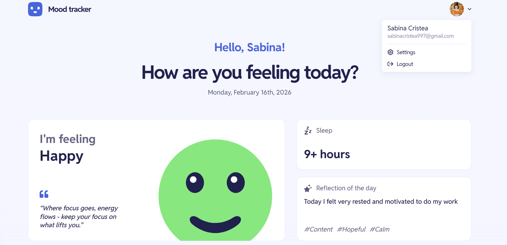
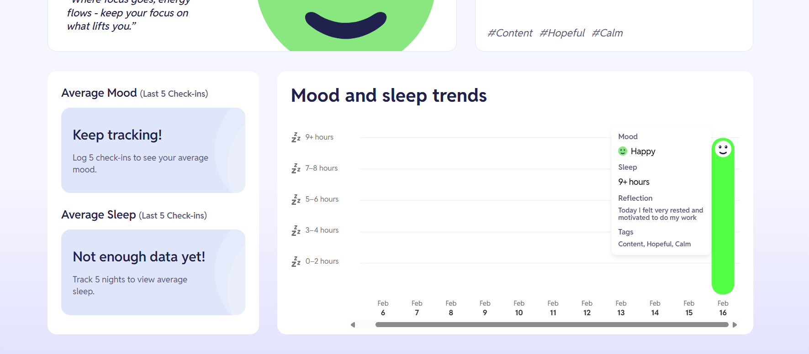
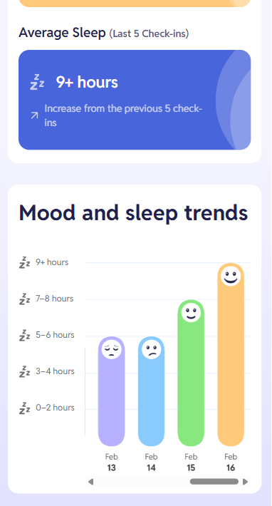
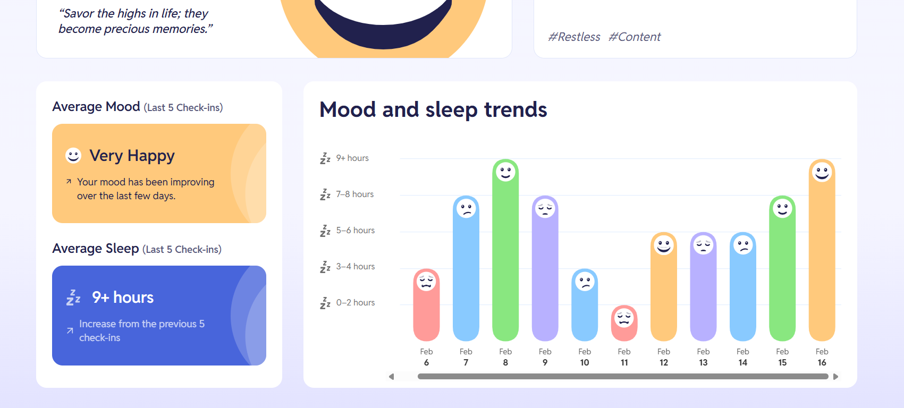
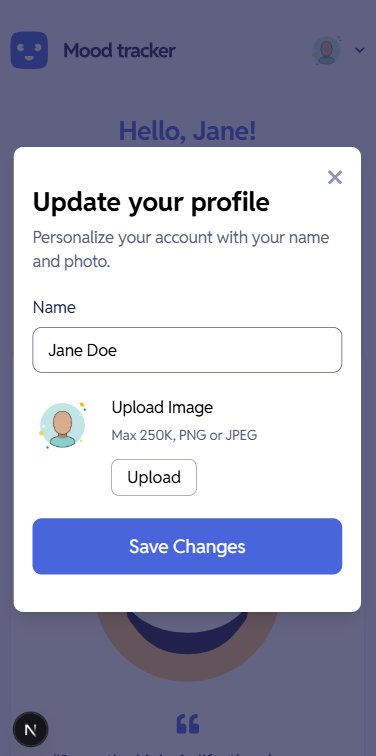

### Links

- Solution URL: [https://github.com/SabinaCristea/mood-tracking]
- Live Site URL: [https://mood-tracking-delta.vercel.app/]

## My process

### Built with

- Mobile-first workflow
- [TypeScript](https://www.typescriptlang.org/)
- [Next.js](https://nextjs.org/) - React framework
- [TailwindCSS](https://tailwindcss.com/) - For styles
- [Convex](https://www.convex.dev/) - Database
- [Clerk](https://clerk.com/) - Authentication & User Management
- [ChartJS](https://www.chartjs.org/) - Charting Library

### Features

**- Full-Stack Integration:** Real-time data syncing using Convex and secure user management via Clerk.
**- Multi-Step Check-in:** An intuitive four-step logging process for capturing mood, feelings, reflections, and sleep quality.
**- Dynamic Trend Analysis:** Custom logic to calculate mood and sleep trends by comparing today’s data against a rolling 5-day average.
**- Advanced Data Visualization:** Interactive charts built with Chart.js that display the last 11 records with custom styling and tooltips.
**- Personalized Insights:** Contextual mood quotes and visual feedback (icons and colors) based on the user's current emotional state.
**- Profile Management:** Ability to update user metadata and avatars directly within the app.
**- Responsive Design:** A mobile-first approach ensuring a seamless experience from smartphones to large desktop monitors.

### What I learned

This project was my first time diving into a full-stack architecture using Convex and Clerk. Integrating real-time database management with seamless authentication was a massive learning curve. I learned how to handle relational data (mapping moods and sleep logs to specific users) and how to manage global state using Convex hooks.

The hardest part of this challenge was definitely customizing Chart.js. The default configurations are quite rigid, and matching the specific design requirements - such as custom bar radius, specific grid line styling, and interactive tooltips - required deep diving into the library's API and plugin system.

### Continued development

Database Optimization: Now that I'm comfortable with the basics of Convex, I want to learn more about advanced indexing and schema validation to ensure the app remains performant as the dataset grows.

Complex State Machines: The multi-step logging process (Step 1 to 4) was fun to build. I plan to explore other libraries to manage complex UI flows more declaratively in future projects.

## Author

- Website - [sabinacristea.com](https://www.sabinacristea.com)
- Frontend Mentor - [@SabinaCristea](https://www.frontendmentor.io/profile/SabinaCristea)
- LinkedIn - [Sabina Cristea](https://www.linkedin.com/in/sabina-cristea/)
- Instagram - [@sabinacodes](https://www.instagram.com/sabinacodes/)
